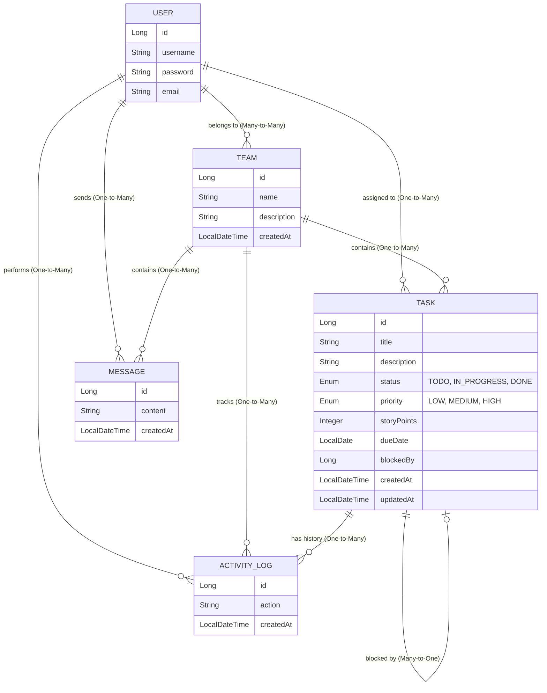

# SyncSpace — Architecture & Planning Document

## Problem Statement

Design a platform that improves team coordination and communication.
The system should simplify workflows and improve visibility of tasks.

---

## Hackathon: PromptWars

### Evaluation Criteria

| #  | Criteria                      | Our Strategy                                                      |
|----|-------------------------------|-------------------------------------------------------------------|
| 1  | Code Quality                  | Clean layered architecture (Controller → Service → Repository)    |
| 2  | Security                      | Spring Security, input validation, CSRF protection                |
| 3  | Efficiency                    | JPA optimized queries, React lazy loading, minimal bundle         |
| 4  | Testing                       | JUnit 5 + Mockito (backend), Vitest + RTL (frontend)              |
| 5  | Accessibility                 | WCAG 2.1, ARIA labels, keyboard navigation, semantic HTML         |
| 6  | Problem Statement Alignment   | Task board, team chat, workspaces, dashboard                      |
| 7  | Google Services Usage         | Deployed on Google Cloud Run                                      |

---

## Tech Stack

### Backend
- **Language**: Java 17+
- **Framework**: Spring Boot 3.x
- **Security**: Spring Security
- **Database**: H2 (embedded) + Spring Data JPA
- **Real-time**: Spring WebSocket (simple)
- **Testing**: JUnit 5 + Mockito + Spring Boot Test
- **Build Tool**: Maven

### Frontend
- **Language**: JavaScript (React 18+)
- **Build Tool**: Vite
- **Styling**: Vanilla CSS
- **HTTP Client**: Fetch
- **Testing**: Vitest + React Testing Library

### Deployment
- **Platform**: Google Cloud Run (single container)
- **Strategy**: React build output bundled into Spring Boot's static/ folder
- **Result**: One JAR, one container, one deployment — no CORS in production

---

## Repo Structure

```
SyncSpace/
├── backend/                        ← Spring Boot
│   ├── src/
│   │   ├── main/
│   │   │   ├── java/com/syncspace/
│   │   │   │   ├── controller/     ← REST controllers
│   │   │   │   ├── service/        ← Business logic
│   │   │   │   ├── repository/     ← JPA repositories
│   │   │   │   ├── model/          ← JPA entities
│   │   │   │   ├── dto/            ← Request/Response DTOs
│   │   │   │   ├── config/         ← Security, CORS, WebSocket config
│   │   │   │   └── SyncSpaceApplication.java
│   │   │   └── resources/
│   │   │       ├── application.properties
│   │   │       └── static/         ← React build output goes here (prod)
│   │   └── test/                   ← JUnit + Mockito tests
│   ├── pom.xml
│   └── Dockerfile
├── frontend/                       ← React (Vite)
│   ├── src/
│   │   ├── components/             ← Reusable UI components
│   │   ├── pages/                  ← Page-level components
│   │   ├── services/               ← API call functions
│   │   ├── App.jsx
│   │   └── main.jsx
│   ├── public/
│   ├── package.json
│   └── vite.config.js
├── README.md
├── ARCHITECTURE.md                 ← This file (git-ignored)
└── .gitignore
```

---

## Core Features

1. **Team Workspaces** — Create and join team workspaces
2. **Kanban Task Board** — Task management with status columns (To Do → In Progress → Done). Includes a **"My Tasks" filter** to simplify workflows for individual contributors.
3. **Jira-Style Workflows** — Effort estimation (Story Points) and task-to-task dependency mapping (Blockers) with visual locks.
4. **Team Chat** — Simple messaging per workspace
5. **Dashboard & Activity Log** — Overview of team progress and a chronological log of all task updates (who did what) to ensure total visibility.

---

## API Design (REST)

### Authentication & Users
| Method | Endpoint              | Description                   |
|--------|-----------------------|-------------------------------|
| POST   | /api/auth/register    | Register a new user           |
| POST   | /api/auth/login       | Authenticate and get token    |
| GET    | /api/users/me         | Get current user details      |

### Teams
| Method | Endpoint              | Description                   |
|--------|-----------------------|-------------------------------|
| GET    | /api/teams            | List all teams                |
| POST   | /api/teams            | Create a team                 |
| GET    | /api/teams/{id}       | Get team details              |
| POST   | /api/teams/{id}/join  | Join a specific team          |
| GET    | /api/teams/{id}/members| List all members in a team   |

### Tasks
| Method | Endpoint                      | Description               |
|--------|-------------------------------|---------------------------|
| GET    | /api/teams/{id}/tasks         | List tasks for a team (supports ?assigneeId filter) |
| POST   | /api/teams/{id}/tasks         | Create a task             |
| PUT    | /api/tasks/{id}               | Update task (status, etc) |
| DELETE | /api/tasks/{id}               | Delete a task             |

### Chat
| Method | Endpoint                      | Description                   |
|--------|-------------------------------|-------------------------------|
| GET    | /api/teams/{id}/messages      | Get messages for a team       |
| POST   | /api/teams/{id}/messages      | Send a message                |

### Dashboard & Activity
| Method | Endpoint                                | Description                                |
|--------|-----------------------------------------|--------------------------------------------|
| GET    | /api/teams/{id}/dashboard/summary       | Get aggregated stats (task counts, etc.)   |
| GET    | /api/teams/{id}/activity                | Get chronological activity log for a team  |

---

## JPA Entities

### Data Model Diagram



### User
- id (Long, auto-generated)
- username (String, unique)
- password (String, hashed)
- email (String, unique)
- teams (ManyToMany → Team)

### Team
- id (Long, auto-generated)
- name (String)
- description (String)
- members (ManyToMany → User)
- createdAt (LocalDateTime)

### Task
- id (Long, auto-generated)
- title (String)
- description (String)
- status (Enum: TODO, IN_PROGRESS, DONE)
- priority (Enum: LOW, MEDIUM, HIGH)
- storyPoints (Integer)
- dueDate (LocalDate)
- blockedBy (ManyToOne → Task)
- assignee (ManyToOne → User)
- team (ManyToOne → Team)
- createdAt (LocalDateTime)
- updatedAt (LocalDateTime)

### Message
- id (Long, auto-generated)
- content (String)
- sender (ManyToOne → User)
- team (ManyToOne → Team)
- createdAt (LocalDateTime)

### ActivityLog
- id (Long, auto-generated)
- action (String, e.g., "moved Task to DONE")
- user (ManyToOne → User)
- team (ManyToOne → Team)
- task (ManyToOne → Task)
- createdAt (LocalDateTime)

---

## Communication (Dev Mode)

- Vite dev server on `localhost:5173` proxies `/api/**` to `localhost:8080`
- No CORS issues in dev or prod
- Frontend uses `fetch("/api/...")` for all API calls

---

## 2-Hour Build Plan

| Time         | What We Build                                                          |
|--------------|------------------------------------------------------------------------|
| 0:00 – 0:30  | Scaffold Spring Boot + React. JPA entities + REST APIs (Team, Task, Message) |
| 0:30 – 1:00  | React UI — Task Board page, Team list/create. Connect to backend APIs  |
| 1:00 – 1:30  | Chat page. Dashboard page. Spring Security. Accessibility (ARIA)       |
| 1:30 – 1:50  | Write tests (JUnit + Vitest). Polish UI                                |
| 1:50 – 2:00  | Dockerize, deploy to Google Cloud Run, push to GitHub                  |

---

## Status

- [x] Problem statement understood
- [x] Tech stack agreed upon (Spring Boot + React + H2 + Cloud Run)
- [x] Repo structure agreed upon
- [x] API design planned
- [x] Entity design planned
- [x] 2-hour timeline set
- [x] Backend scaffolded
- [x] Frontend scaffolded
- [x] Core features implemented
- [x] Tests written
- [x] Deployed to Google Cloud Run
- [x] Pushed to GitHub

---

## Frontend Design System: Bauhaus

### 1. Design Philosophy
The Bauhaus style embodies the revolutionary principle "form follows function" while celebrating pure geometric beauty and primary color theory. This is **constructivist modernism**—every element is deliberately composed from circles, squares, and triangles. 

**Vibe**: Constructivist, Geometric, Modernist, Artistic-yet-Functional, Bold, Architectural

**Key Characteristics**:
- **Geometric Purity**: Circles, squares, and triangles.
- **Hard Shadows**: 4px and 8px offset shadows (no blur).
- **Color Blocking**: Solid primary colors as backgrounds.
- **Thick Borders**: 2px and 4px black borders.
- **Constructivist Typography**: Massive uppercase headlines.
- **Functional Honesty**: No gradients, no subtle effects.

### 2. Design Token System
*   **Colors:**
    *   `background`: `#F0F0F0` (Off-white canvas)
    *   `foreground`: `#121212` (Stark Black)
    *   `primary-red`: `#D02020` (Bauhaus Red)
    *   `primary-blue`: `#1040C0` (Bauhaus Blue)
    *   `primary-yellow`: `#F0C020` (Bauhaus Yellow)
    *   `primary-green`: `#20A020` (Bauhaus Green - Used exclusively for DONE states)
    *   `border`: `#121212`
*   **Typography:** **'Outfit'** (geometric sans-serif from Google Fonts). Extreme contrast between headings (text-6xl+) and body. Heavy weights (900/700) for headers.
*   **Radius:** Binary extremes—either `rounded-none` (0px) or `rounded-full` (9999px).
*   **Borders:** `border-2` (mobile) to `border-4` (desktop). Black always.
*   **Shadows:** Hard offset shadows (`shadow-[4px_4px_0px_0px_black]`).

### 3. Component Stylings
*   **Buttons:** `bg-[primary-color] text-[contrast] border-2 border-black shadow-[4px_4px_0px_0px_black]`. Active state translates down/right to simulate physical press.
*   **Cards:** White bg, `border-4 border-black`, hard shadows. Often decorated with small geometric shapes in the top-right corner.

### 4. Layout & Details
*   **Non-Generic:** Avoid Tailwind/Bootstrap defaults. Use solid color blocks for entire sections.
*   **Icons:** `lucide-react` with 2px or 3px stroke, placed in geometric containers.
*   **Animations:** Mechanical, snappy, geometric (`duration-200 ease-out`). No soft organic movements.
